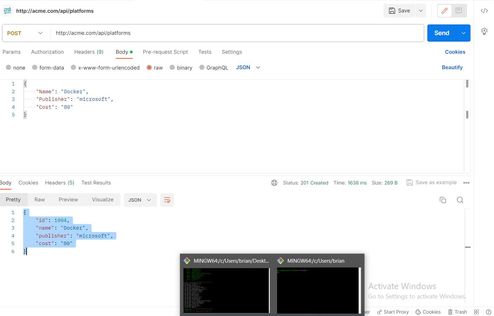
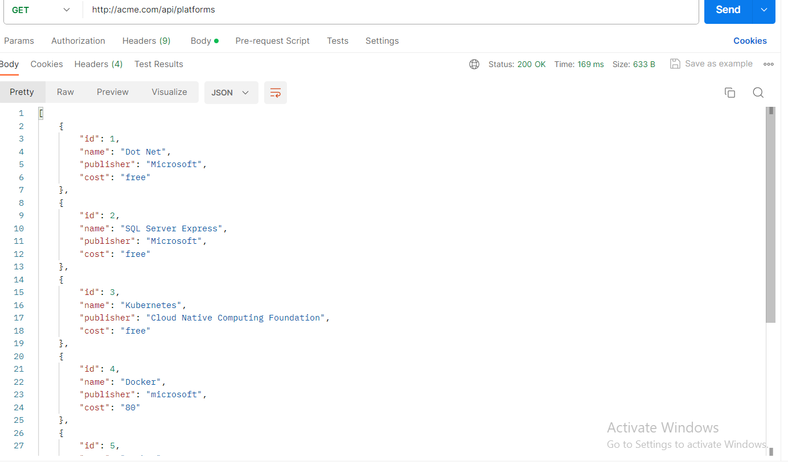

# An Introduction to Microservices using .NET

Welcome! "Microservices using .NET" project! This platform management backend application allows you to add various tech platforms, such as Docker and SQL Server, along with their associated commands, to a database. It's a demonstration of microservices architecture with a focus on .NET technologies.

## Repository

- **Repository URL**: [dotnet-microservices](https://github.com/MwambiaBrian/dotnet-microservices)

## Project Overview

Below are the key components and features of the project:

- Implementation of two .NET Microservices using the REST API pattern
- Utilization of dedicated persistence layers for both services
- Deployment of the services to a Kubernetes cluster for scalability and container orchestration
- Implementation of the API Gateway pattern to efficiently route incoming requests to the respective services
- Establishment of synchronous messaging between services using both HTTP and gRPC for improved performance
- Implementation of asynchronous messaging between services using an Event Bus powered by RabbitMQ, providing flexibility and robust event-driven communication

## Screenshots

### POST a new Platform



This screenshot illustrates the process of adding a new tech platform to the database using a POST request.

### GET all platforms



This screenshot shows the response when requesting a list of all available platforms via a GET request.

## Docker Image Repository

To make deployment and scaling easier, Docker images for the services are available on Docker Hub. You can pull these images from the Docker Hub repository hosted at `nelsb`. Here's how you can pull the images:

```shell
docker pull nelsb/platformservice
docker pull nelsb/commandservice
```

## Deploying

Make sure you have Docker Desktop installed and running with kubernetes enabled

1. Clone the repository

```shell
git clone github.com/MwambiaBrian/dotnet-microservices.git
```

2. Change directory to K8s folder

```shell
cd ./K8S
```

3. Deploying all the services using kubectl starting with the platform service

```shell
kubectl apply -f platfroms-depl.yaml
kubectl apply -f commands-depl.yaml

```

4. Deploy NGINX (Ingress api gateway)

```shell
kubectl apply -f ingress-serv.yaml
```

5. Deploy the database and a persistent volume claim

```shell
kubectl apply -f local-pvc.yaml
kubectl apply -f mssql-plat-depl.yaml
```

6. Deploy RabbitMq

```shell
kubectl apply -f rabbitmq-depl.yaml
```

## What I learnt

I gained a real-world experience of microservices architecture implemented in .NET. on Kubernetes.
Deploying on kuberentes cluster
